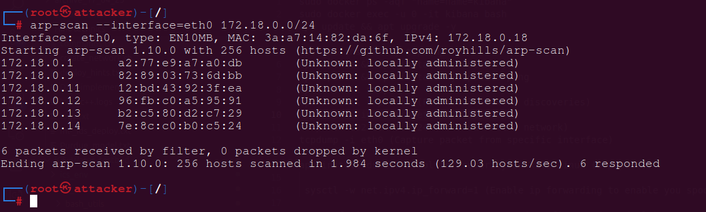
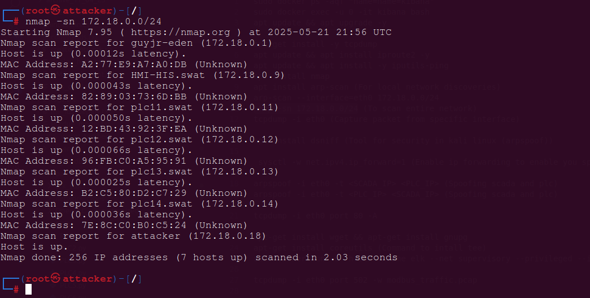

# Manual for Reconnaissance on PLCs

Most complex attacks complex or simple start with this phase, information gathering then crafting an exploit to counter attack. This can also be done in this simple testbed. Assuming the attacker is already in the network, he could gather a lot of information

## *ICS Network  network environment*
At this level, we consider you've installed the original testbed network (i.e from Yi Zhu's work). No mitigation solution has been implemented yet so all the components in the swat network can communicate with each other, no isolation nor segmentation is implemented yet.

## *Services running after running testbed*

Docker Containers

```bash
docker ps 
```

Displays the list of containers, you should have 06 plcs running, scadaBR and sim running.

**ScadaBR**
   - **Role:** Simulates a HMI and Historian in the Scada Network.
   - **Network:**
     - `Name` (Swat) 
     - `Ip address` (IP: 172.18.0.10)
   - **Ports:** 10010:8080

**PLC11**
   - **Role:** Simulates a PLC via OpenPLC in the Scada Network.
   - **Networks:**
     - `Name` (Swat)
     - `network2` (IP: 172.18.0.11)
   - **Ports:** 10011:8080

**PLC12**
   - **Role:** Simulates a PLC via OpenPLC in the Scada Network.
   - **Networks:**
     - `Name` (Swat)
     - `network2` (IP: 172.18.0.12)
   - **Ports:** 10012:8080

## *Accessing the Components on the browser*

1. **PLC11 Dashboard**:
   - URL: `http://172.18.0.11:10011`
   - **Username**: `openplc`
   - **Password**: `openplc`

1. **PLC12 Dashboard**:
   - URL: `http://172.18.0.12:10012`
   - **Username**: `openplc`
   - **Password**: `openplc`

## *Accessing the Components on via the docker cli*

bash:
```bash
# For plc11
docker exec -it plc11 bash 
# For plc12
docker exec -it plc12 bash 
```

**NB:** There are 06 PLCs in total, from PLC11 ... PLC16, they are in the same network named (swat) with their port number corresponding to their names 
**Ex :** Name :  PLC11, Port : 10011

## *Setting up the attacker's machine*

Docker command:
```bash
sudo docker run -d -t --net swat --hostname attacker --name attacker --privileged --ip 172.18.0.18 -p 10018:8080 kalilinux/kali-rolling
```

Docker container

**Attacker**
   - **Role:** Simulates the attacker in the Scada network.
   - **Networks:**
     - `Name` (Swat)
     - `network2` (IP: 172.18.0.18)
   - **Ports:** 10018:8080
   - **Description:** The attacker will install the basic tools to counter attack.

## *Accessing the attacker's machine via the docker cli*

bash:
```bash
docker exec -it attacker bash
```

**NB:** We assume the attacker is already in the swat network so he can access other components of the Scada network

## Network scanning using tools presented earlier

When in the attacker's machine, you could install and run the tools you wish. For our examples, we used these tools for information gathering : 

Attacker's terminal
```bash
nmap -sn 172.18.0.0/24
arp-scan --interface=eth0 172.18.0.0/24
```




You could find some information on the plcs found in the network

## Capture traffic between PLC and other components (ScadaBR)

tcpdump and wireshark were used for this, they are very easy to install on linux based docker containers. The attacker needs to spoof both plc and scadaBR to be able to capture their traffic. Everything is done in the attackers terminal, you could open several terminals. 

### Spoofing using arpspoof

Attacker's terminal
```bash
arpspoof -i eth0 -t 172.18.0.10 172.18.0.11
arpspoof -i eth0 -t 172.18.0.11 172.18.0.10
```

- You have to do this on two different terminals. Afterword, you could run tcpdump command on another terminal

Attacker terminal
```bash
tcpdump -i eth0 port 502 -w modbus_traffic.pcap
```

- After capturing the pcap file, you could analyze it with wireshark. For sure, you will discover various security flaws that you could exploit
- The testbed's flexibility even enables you transfer the pcap file to you host for other analysis if you wish. 
- There're some pcap samples found in `Captured_packets`

bash
```bash
docker cp attacker:/scripts/modbus_traffic.pcap ./analysis
```

