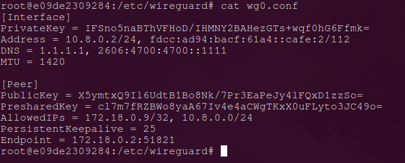

# Securing SCADA Communications with WireGuard in Docker Securing SCADA Communications with WireGuard in Docker

This section demonstrates how to securely tunnel communication between a PLC and ScadaBR using WireGuard inside a Docker container, effectively securing industrial communication paths in a SCADA environment.

## What This Setup Includes

- A WireGuard server `wg-easy` running in a Docker container.
- PLCs acting as a WireGuard clients.
- All traffic between the PLC and ScadaBR is tunneled securely via the VPN.
- Protection against common network attacks like spoofing, sniffing, and unauthorized scanning.

## Installation 

We assume that the scada network is already running and the container is added directly in the flat network names swat. `docker network inpsect swat` could enable you have more information about the network. 

- Create docker-compose.yml 

```
volumes:
  etc_wireguard:

services:
  wg-easy:
    image: ghcr.io/wg-easy/wg-easy:15
    container_name: wg-easy
    networks:
      - swat
    volumes:
      - etc_wireguard:/etc/wireguard
      - /lib/modules:/lib/modules:ro
    ports:
      - "51820:51820/udp"
      - "51821:51821/tcp"
    restart: unless-stopped
    cap_add:
      - NET_ADMIN
      - SYS_MODULE
    sysctls:
      - net.ipv4.ip_forward=1
      - net.ipv4.conf.all.src_valid_mark=1
      - net.ipv6.conf.all.disable_ipv6=0
      - net.ipv6.conf.all.forwarding=1
      - net.ipv6.conf.default.forwarding=1

networks:
  swat:
    external: true
    # ipv4_address: 172.18.0.30  # example static IP
```

- Start the wireguard container
bash
```
docker compose up -d
```


## Access the WireGuard Web UI

Open `http://localhost:51821` in your browser.


- In the admin panel, add a new client or peer that will be used by the PLC (clients)


- Download the config file 


- Install WireGuard on the PLC

bash
```
docker exec -it plc11 bash
```

plc terminal
```
apt update && apt install wireguard
```
- After installing wireguard on the clients, that is the plcs we have to generate keys in the plcs (PLC11 on this case)

plc11 bash
```
wg genkey | tee private.key | wg pubkey > public.key
```

- This key will be shared with the wireguard server in its config file to authenticate the clients during communication

- Client config on the plc, needed by the wireguard server for proper VPN operations



### Config contents (For clients)

```
[Interface]
PrivateKey = <plc_private_key>
Address = 10.8.0.2/24
DNS = 1.1.1.1
MTU = 1420

[Peer]
PublicKey = <wireguard_server_public_key>
PresharedKey = <matching_preshared_key>
Endpoint = 172.18.0.2:51820
AllowedIPs = 172.18.0.9/32, 10.8.0.0/24
PersistentKeepalive = 25
```

In the `interface` section : 

- *Privatekey:* The private key of client generated on the PLC
- *Address:* The virtual address of the PLC on the virtual network created by wireguard
- *MTU:* Maximum Transmission Unit

In the `Peer` section:

- *PublicKey:* WireGuard server's public key (from wg-easy)
- *PresharedKey:* from wg-easy (wireguard) config for the peer
- *Endpoint:* points to the WireGuard container's IP `172.18.0.2:51821` 
- *AllowedIPs:* `172.18.0.9/32` - to route ScadaBR traffic through the VPN, `10.8.0.0/24` - to allow talking to the VPN interface itself (e.g. `ping 10.8.0.1`)
- On the Wiregaurd server (Container name: wg-easy), we have to make sure the peer for the PLC has *AllowedIPs:* `10.8.0.2/32` and should include the `public key` from the PLC 


- In the wireguard container, make sure you add NAT rule to allow traffic from `10.8.0.0/24` (VPN)  to reach the Docker bridge network `swat` *172.18.0.0/24*

wg-easy
```bash
# Allow forwarding between WireGuard and Docker network
iptables -A FORWARD -i wg0 -o docker0 -j ACCEPT
iptables -A FORWARD -i docker0 -o wg0 -j ACCEPT

# Enable NAT from WireGuard to Docker network
iptables -t nat -A POSTROUTING -s 10.0.0.0/24 -o docker0 -j MASQUERADE
```

- In the scadaBr container, we have to add a route so that it could communicate with the plcs in the virtual network

Scadabr bash
```bash
ip route add 10.8.0.0/24 via 172.18.0.2
```

## How WireGuard Helps Secure SCADA Systems

| Threat            | How WireGuard Helps             |
|------------------|--------------------|
| IP Spoofing     | Rejects all unauthenticated traffic     | 
| Packet Sniffing    | Full end-to-end encryption (ChaCha20)     | 
| Replay Attacks      | Uses unique counters, packets can’t be reused      | 
| Unauthorized Scanning             | VPN subnet is invisible to non-peers      | 
| Credential Harvesting    | No passwords; identity via cryptographic keys     | 

## Why is it flexible and easy ?

- *Runs in Docker:* deployable on any host
- *Web UI (wg-easy):* makes peer creation fast
- *Cross-platform clients:* connect Linux, Windows, or embedded devices
- *Low overhead:* fast and lean compared to IPSec/OpenVPN
- *Can scale:* add multiple PLCs easily, each isolated via config


